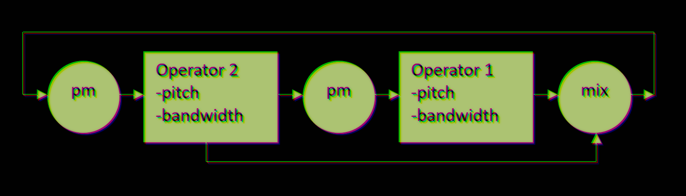

# FunFM-logue
exploration oscillator for KORG Logue platform

https://www.youtube.com/watch?v=Je-KoZBqLsE

Consists of 2 extended range alias supressed FM operators with variable waveshape.

Each operator is capable of generating different waveforms, from pulse to sine to sawtooth. Unlike all other oscillators, the wave transition algorithm is not a crossfade, but is a bit like low-pass filtering. A pulse (bw=-100) can be “filtered” to a sine (bw=0), and then “unfiltered” to a saw (bw=100).
The modulation depth is bipolar: positive is the normal depth, negative is the absolute input value, sometimes giving a different result with more odd harmonics.
the output is an x-fade between op1 and op2, the value is then used as feedback modulation for op2.

### Parameters:

- Shape - high resolution op1 pitch offset
- Alt - high resolution op2 pitch offset
- 1bw - op1 bandwidth
- 1pm - op1 by op2 phase modulation depth
- 2bw - op2 bandwidth
- 2fb - op2 by feedback phase modulation depth
- mix - crossfade between operators
- fblp - feedback 1st order low pass filter

LFO shape is routed to 1pm

### History:

The idea was born after meeting KORG Opsix. Despite the relatively convenient control, the synthesizer was disappointing with its low sampling rate and aliasing noises when deviating from the classic sinusoidal fm. The first proof-of-concept was created in 2021 with the support of the [Cultural Transit Foundation Yekaterinburg](http://www.cultt.ru/) as part of the laboratory of electronics in art. Thanks to all participants and artists for the inspiration!

### Build and load example

    git submodule update --init --recursive
    cd funfm-src
    make install PLATFORMDIR=../logue-sdk/platform/minilogue-xd/
    ./../logue-sdk/tools/logue-cli/get_logue_cli_msys64.sh
    ./../logue-sdk/tools/logue-cli/logue-cli-win64-0.07-2b/logue-cli.exe load -i 0 -o 0 -u FunFM.mnlgxdunit

### Note

The NTS-1 initializes the parameters to -100, so the first sound you hear will be the harsh noise resulting from maximum PM and feedback. I recommend starting by setting the depths and pitches to the middle. The pitch range is intentionally wide, and the extremes are quite random. Please use your ears to adjust the settings. In general, the oscillator is capable of producing classic VA tones (detuned SAW, PWM, hardsync), but the main goal is to search for something new. Stay open to new things)

Peace!
